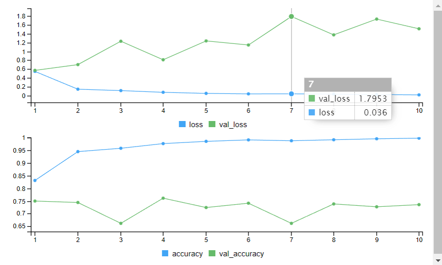
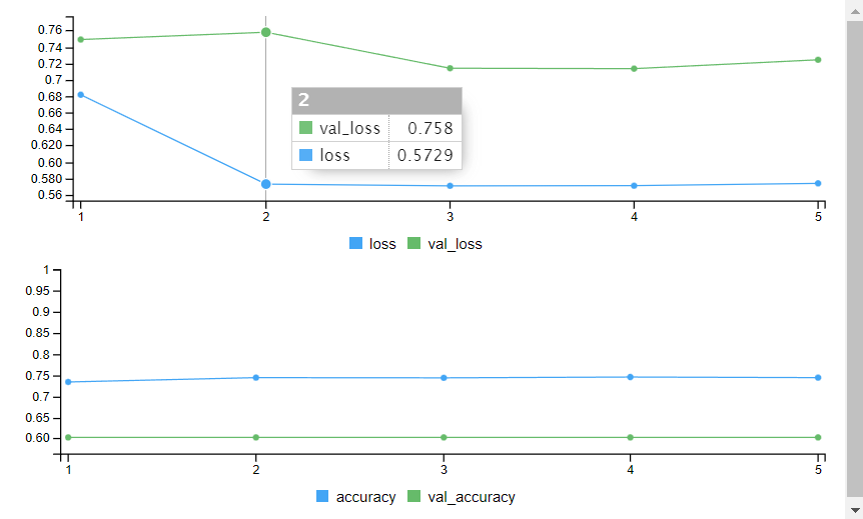
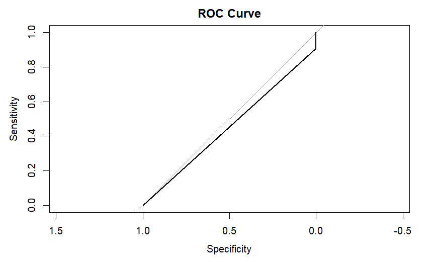
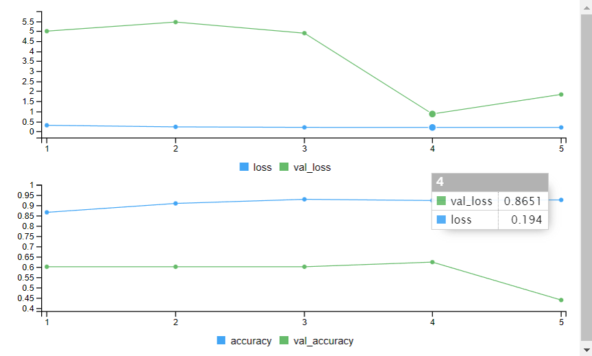
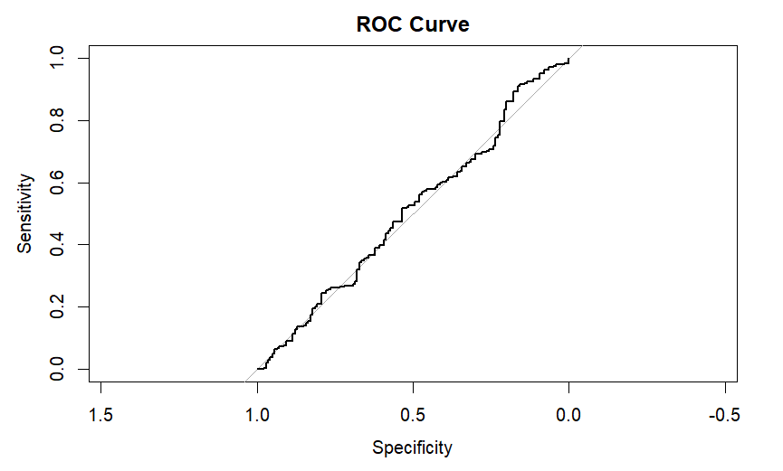
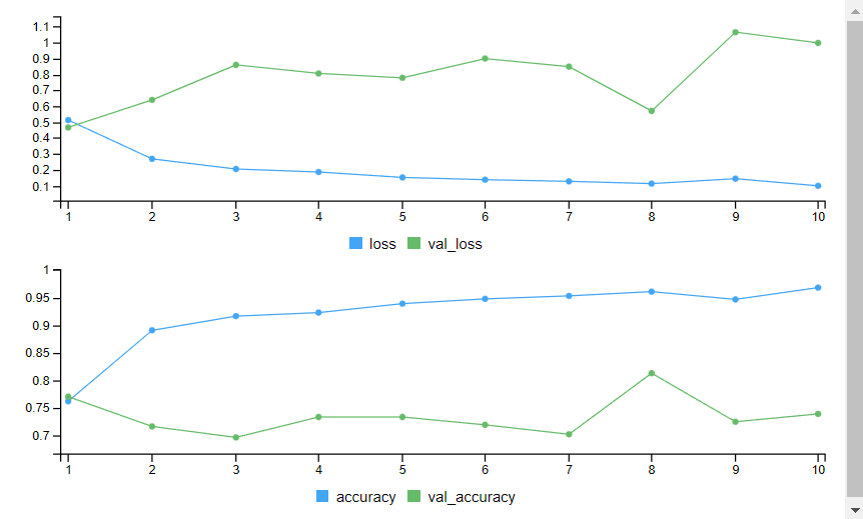
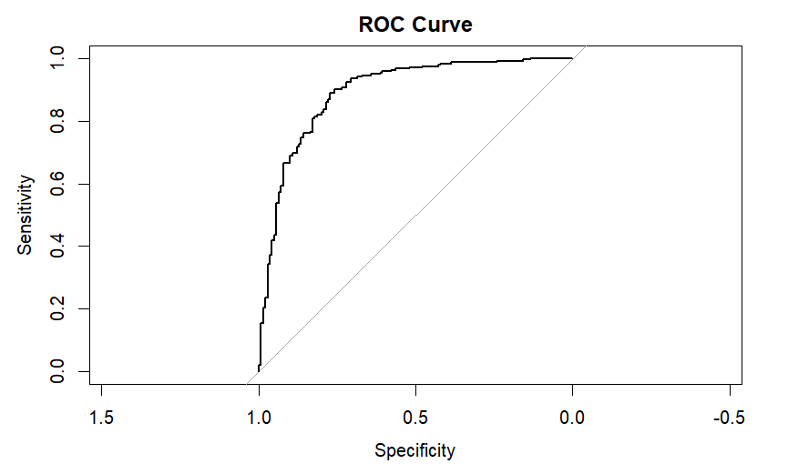

# Enhancing Pneumonia Diagnosis: Deep Learning Approaches with Chest X-Ray Images

First and foremost, I'd like to express my gratitude to the team members who effectively developed this model using various learning algorithms to identify the most proficient one.

The exploration of deep learning methodologies to revolutionize pneumonia diagnosis using chest X-ray images.

Leveraging algorithms such as:
- Convolutional Neural Network (CNN)
- Visual Geometry Group (VGG)
- Residual Networks (ResNet)
- LeNet-5 (LN-5)

Aims to significantly enhance the precision and efficiency of pneumonia detection through robust classification models

## Feature
**Feature Extraction**
- *FeatureExtraction.R*

**File Model**
- *CNN.R*
- *VGG.R*
- *ResNet.R*
- *LeNet-5*

**Evaluated Model**
- *Evaluate_Model.R*

## Testing

Before proceeding with the code execution, ensure to load the necessary libraries for seamless functionality.

```
    library(keras)
    library(tensorflow)
    library(Metrics)
    library(pROC)
    library(tidyverse)
```
If the required libraries are not already installed, they must be installed first to proceed.

## Result

For the results of the evaluated model, our team employs various metrics and techniques to understand the model's predictive capability and generalization ability, such as accuracy, precision, recall, F-score, and the ROC curve

In the README, we solely present ROC curve images example for data split into 40% for training and 60% for testing. For a comprehensive understanding of other results, please refer to the paper for detailed information

Convolutional Neural Network



Visual Geometry Group



Residual Networks



LeNet-5




